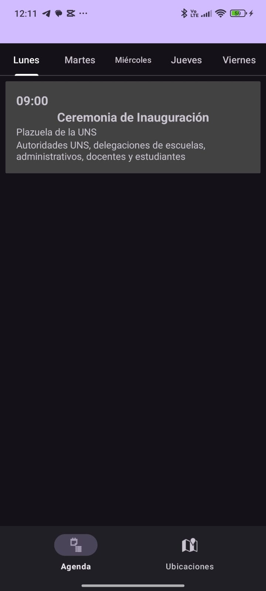
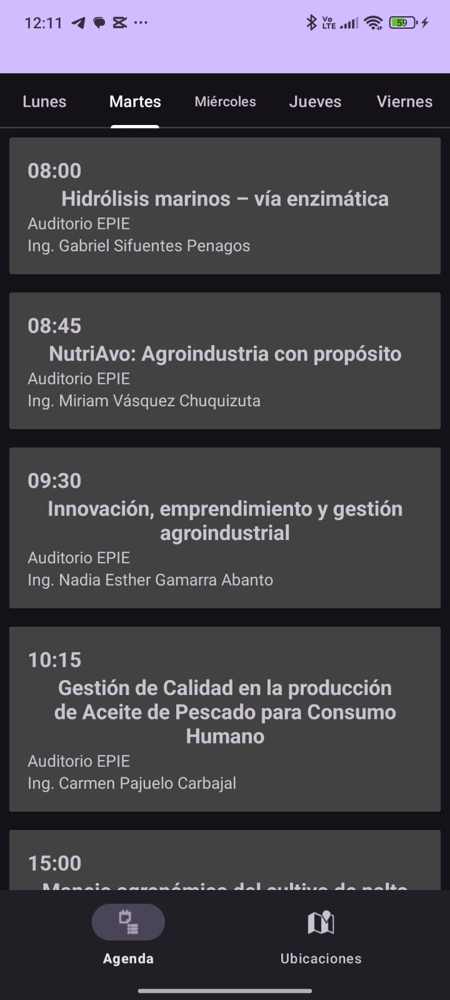
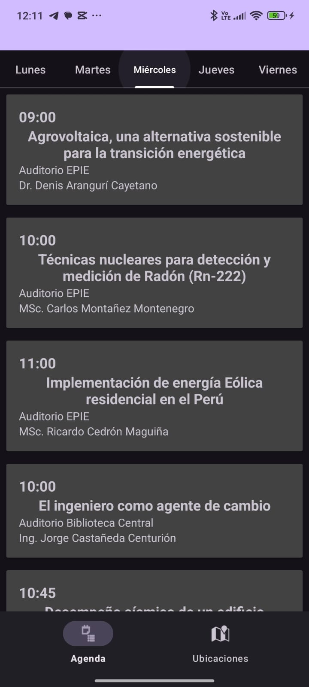
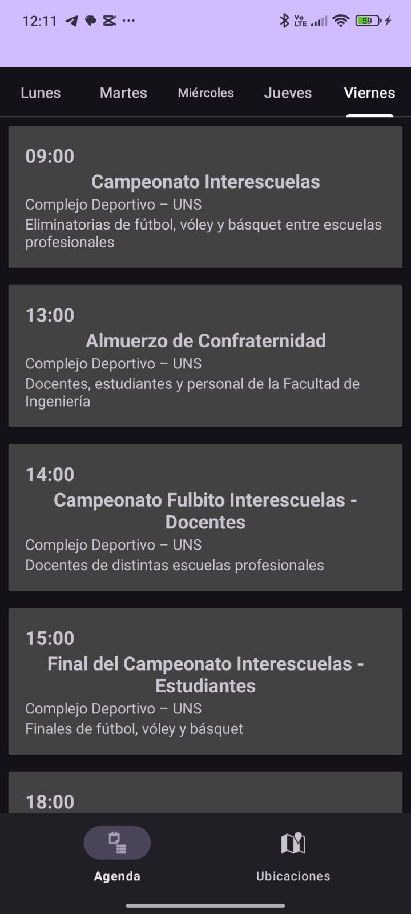
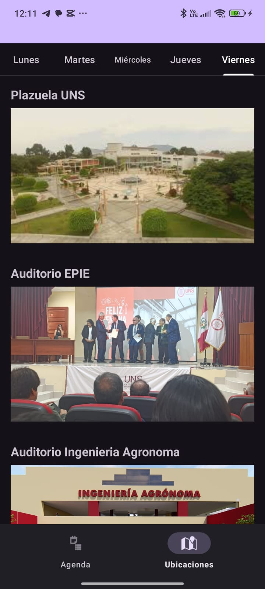

# S7-Briceno-IngeWeek – Cronograma de la Semana de Ingeniería en la Universidad Nacional del Santa

S7-Briceno-IngeWeek es una aplicación móvil Android desarrollada en Kotlin que presenta el cronograma detallado de la Semana de Ingeniería de la Universidad Nacional del Santa. Este proyecto fue realizado como práctica para el curso de Aplicaciones Móviles.

La app inicia con una lista de días de la semana. Al seleccionar un día, se muestran todas las actividades programadas: hora, título, lugar y ponente. Las actividades están organizadas mediante tarjetas que permiten una navegación clara e intuitiva para estudiantes, docentes y asistentes al evento.

Esta herramienta fue creada con el objetivo de ofrecer una forma práctica de consultar el programa oficial, facilitando la planificación y participación en las actividades de la Semana de Ingeniería dentro de nuestra universidad.

## 📸 Capturas de pantalla

| 🟢 **Lunes** | 🔵 **Martes** | 🟣 **Miércoles** |
|-------------|--------------|--------------|
|  |  |  |

 |🟠 **Jueves** | 🔴 **Viernes** | 🗺️ **Ubicaciones** |
|-------------|--------------|--------------|
|  |  |  |

## 📱Características

- Lista organizada por días de la semana.
- Visualización clara de actividades con hora, título, lugar y ponente.
- Diseño moderno con tarjetas (cards).
- Uso de RecyclerView para eficiencia en listas.
- Código modular y mantenible.

## 🛠️Tecnologías utilizadas

- Kotlin
- Android Studio
- RecyclerView
- ViewHolder pattern
- XML Layouts
